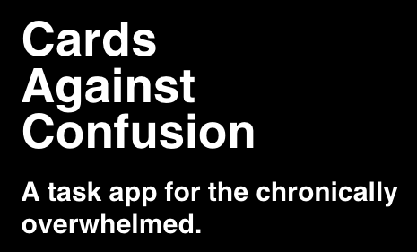
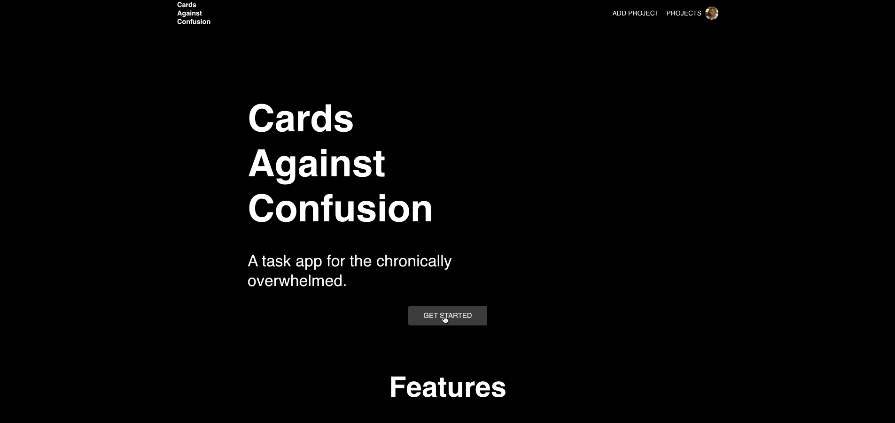

<a href="https://localhost:3000/">
    
</a>


 
# Cards Against Confusion

### Contents

- [Why](#why)
- [Running the App](#running-the-app)
- [Features](#key-features)
- [Support](#support)
- [Contributors](#contributors)
- [Credits](#credits)

## Why

[We](#contributors) met in a fellowship and were given a challenge - 
create a flashcard app.

We realized we weren't inspired by flashcards and decided to create 
a task management app with a flashcard-inspired UI. Cards Against Confusion 
uses AI to generate task lists based on user input. Tell the app what you want 
to plan - with or without details - and receive a detailed task list with 
descriptions and tasks ranked by priority.

---

## Running the App

```bash
$ npm i
$ npm run dev
```

### Environment variables

NEXT_PUBLIC_FIREBASE_API_KEY <br/>
NEXT_PUBLIC_FIREBASE_AUTH_DOMAIN <br/>
NEXT_PUBLIC_FIREBASE_PROJECT_ID <br/>
NEXT_PUBLIC_FIREBASE_STORAGE_BUCKET <br/>
NEXT_PUBLIC_FIREBASE_MESSAGING_SENDER_ID <br/>
NEXT_PUBLIC_FIREBASE_APP_ID <br/>
NEXT_PUBLIC_FIREBASE_APP_MEASUREMENT_ID <br/>
STRIPE_SECRET_KEY <br/>
NEXT_PUBLIC_STRIPE_PUBLISHABLE_KEY <br/>
NEXT_PUBLIC_CLERK_PUBLISHABLE_KEY <br/>
CLERK_SECRET_KEY <br/>
OPENAI_API_KEY 

---

## Key Features



<table style="border-collapse: collapse; border: none;">
    <tr>
        <td style="padding: 10px;" align="center" width="350px">
            <div>
                <h4>AI-Generated Task Lists</h3>
                <h4>Auto Task Ranking</h3>
                <h4>Firebase Database Integration</h3>
                <h4>Daily Focus List</h3>
                <h4>Clean, Intuitive Interface</h3>
            </div>
        </td>
        <td style="border: none; padding: 10px;" align="center" width="350px">
            <div>
                <h4>Add/Edit/Delete Tasks </h3>
                <h4>Dark/Light mode  </h3>
                <h4>Mobile Responsive</h3>
                <h4>User Authentication</h3>
                <h4>Stripe Payment Integration</h3>
            </div>
        </td>
    </tr>
</table>

           


---

### Support
[](https://github.com/katrinars/flashcard-app/stargazers)

Please consider giving us a star on GitHub. Thank you for your support! 🌟


## Contributors

---
<!-- ALL-CONTRIBUTORS-LIST:START - Do not remove or modify this section -->
<!-- prettier-ignore-start -->
<!-- markdownlint-disable -->
<table>
  <tbody>
    <tr>
      <td align="center" valign="top" width="14.28%"><a href="https://github.com/katrinars"><br /><sub><b>katrinars</b></sub></a><br /><a href="https://github.com/katrinars/flashcard-app/commits?author=katrinars" title="Code">💻</a> <a href="https://github.com/katrinars/flashcard-app/commits?author=katrinars" title="Documentation">📖</a></td>
      <td align="center" valign="top" width="14.28%"><a href="https://github.com/xshlxy"><br /><sub><b>Ashley Oliveira</b></sub></a><br /><a href="#design-xshlxy" title="Design">🎨</a></td>
      <td align="center" valign="top" width="14.28%"><a href="https://www.linkedin.com/in/sharon-peters-60a840191/?trk=eml-jobs_jymbii_digest-header-0-profile_glimmer"><br /><sub><b>Sharon Peters</b></sub></a><br /><a href="#ideas-majesticace" title="Ideas, Planning, & Feedback">🤔</a></td>
    </tr>
  </tbody>
</table>

<!-- markdownlint-restore -->
<!-- prettier-ignore-end -->

<!-- ALL-CONTRIBUTORS-LIST:END -->

## Credits

- This app is heavily inspired by [Bill Zhang](https://medium.com/@billzhangsc/creating-a-flashcard-saas-with-openai-and-stripe-7896ddea1dbb).
- [Cards Against Humanity](https://www.cardsagainsthumanity.com/) - name and design inspiration.

--

[Back to top](#cards-against-confusion)
